# K8S集群搭建

## 环境规划

### 集群类型

k8s集群大致分为两类：一主多从、多主多从

- 一主多从：一台master节点和多台node节点，搭建简单，但有单机故障风险，适合用于测试环境
- 多主多从：多台master节点和多台node节点，搭建麻烦，安全性高，适用于生产环境

### 安装方式

k8s有多种部署方式，目前主流的方式有kubeadm、minikube、二进制包

- minikube：一个用于快速搭建单节点kubernetes的工具，适合电脑配置较低的
- kubeadm:  一个用于快速搭建k8s集群的工具，适合电脑配置较高的
- 二进制包：从官网下载每个组件的二进制包，依次去安装，此方式对于理解k8s组件更加有效

本次安装我们选择的是kubeadm方式

### 主机规划

| 作用   | IP地址          | 操作系统                    | 配置         |
| ------ | --------------- | --------------------------- | ------------ |
| master | 192.168.192.100 | Centos7.5    基础设施服务器 | 2C2G 50G硬盘 |
| node1  | 192.168.192.101 | Centos7.5    基础设施服务器 | 2C2G 50G硬盘 |
| node2  | 192.168.192.102 | Centos7.5    基础设施服务器 | 2C2G 50G硬盘 |

安装时，ip地址需要在同一个网段中

## 环境搭建

我们选用vmware工具，模拟出多台虚拟机。

### 主机搭建

主机安装需要使用如下配置：

| 系统配置 | 2C2G 50G硬盘                                           |
| -------- | ------------------------------------------------------ |
| 语言选择 | 中文简体                                               |
| 软件选择 | 基础设施服务器                                         |
| 分区选择 | 自动分区                                               |
| 网络配置 | 根据宿主机网段配置网络<br />dns设置阿里dns服务器<br /> |

下面是虚拟机的安装过程：

  

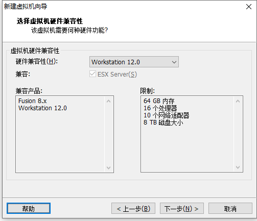  

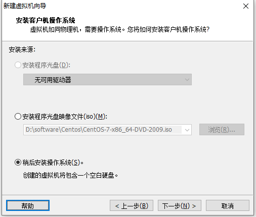 

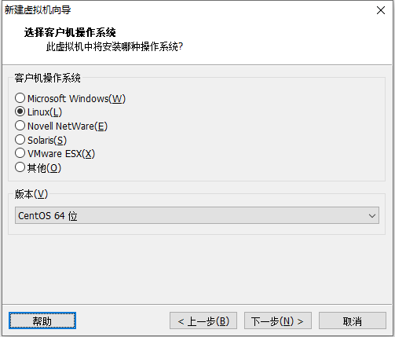 

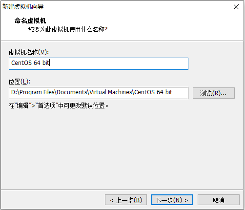 

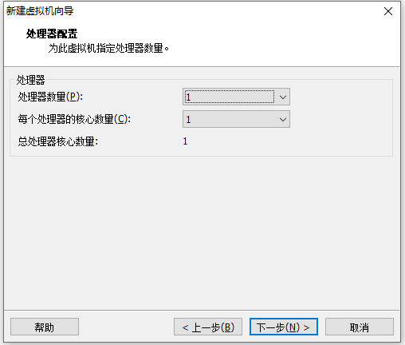 

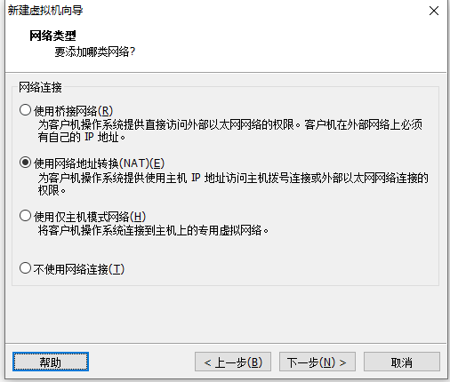 

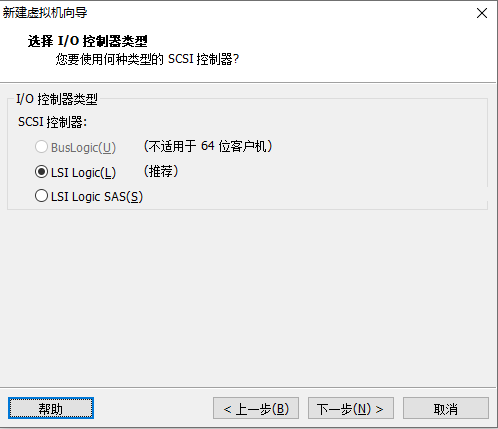 

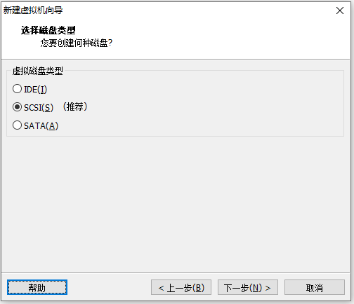 

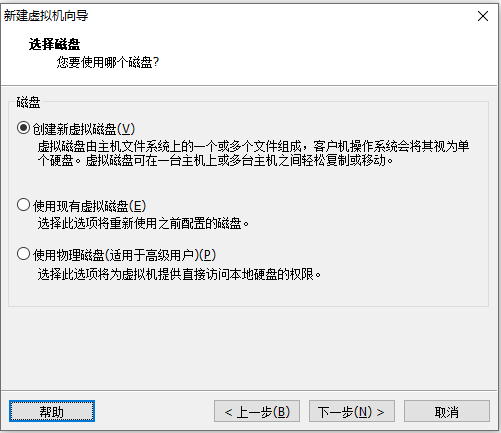 

 

为虚拟机添加镜像 

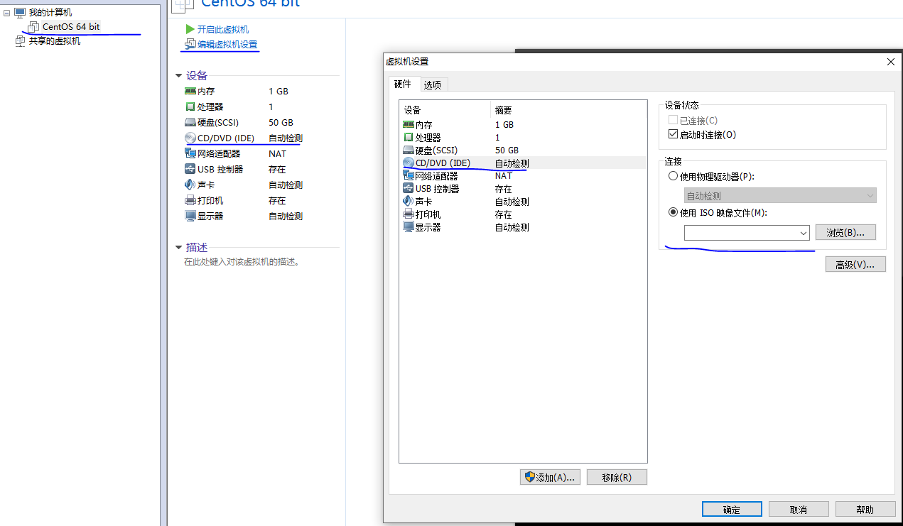 

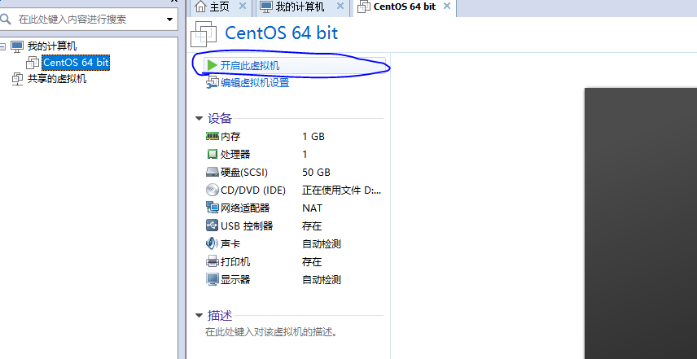 

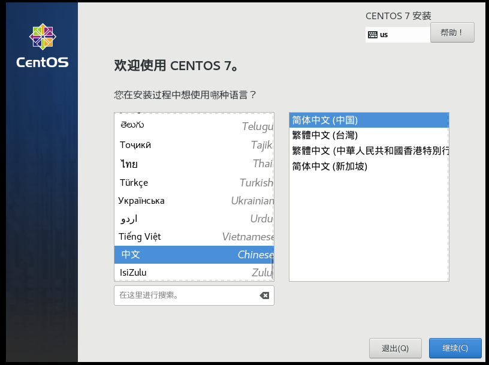 

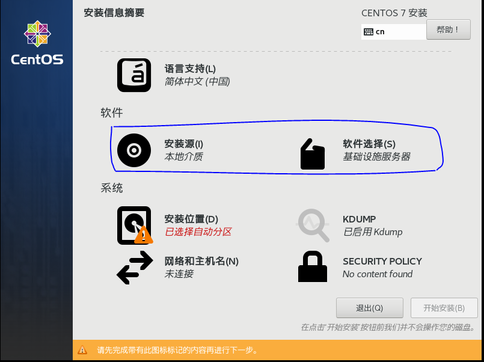 

设置vm在可用时自动连接到网络 

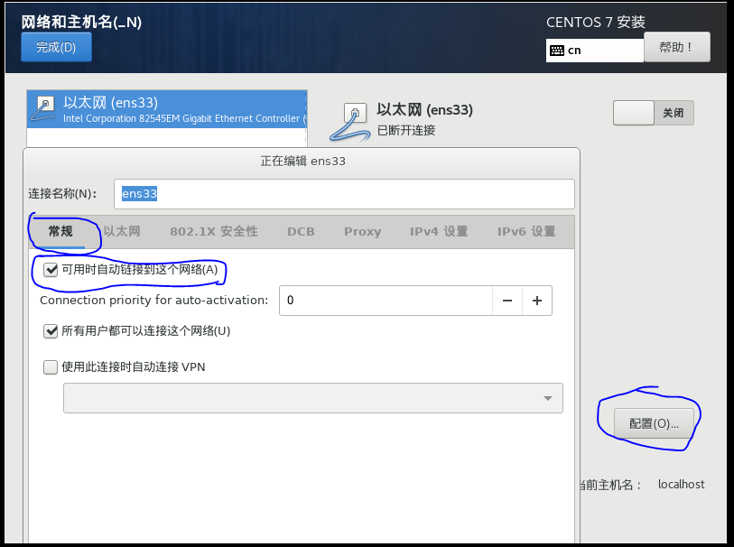 

查看宿主机的nat模式下的网段

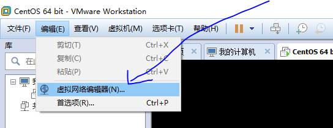 


查看nat模式下的网段：192.168.192.0

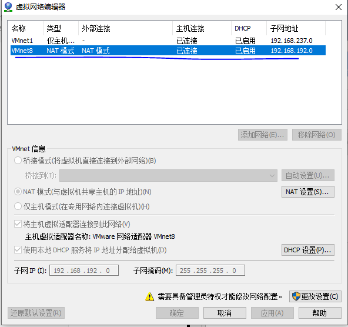 

配置ip地址、网关以及dns（这里配置的是阿里dns服务器） ，点击保存

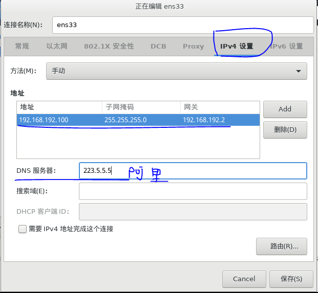 

到这一步我们就可以点击保存，然后安装并启动虚拟机了。

**重要：**搭建虚拟过程还是比较耗时的，我们可以把这台虚拟机做成一个基线，copy这台vm三台出来做k8s集群的搭建。

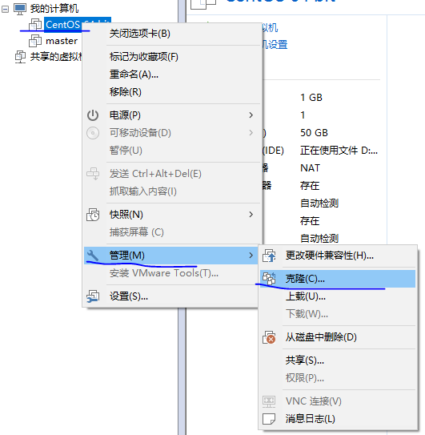 

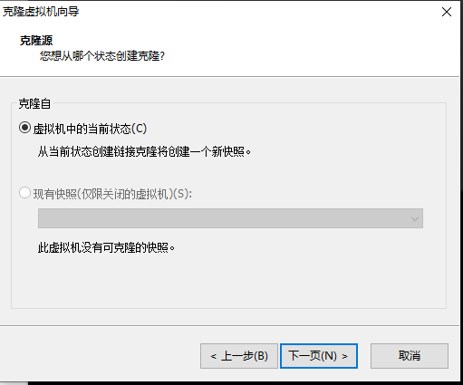 

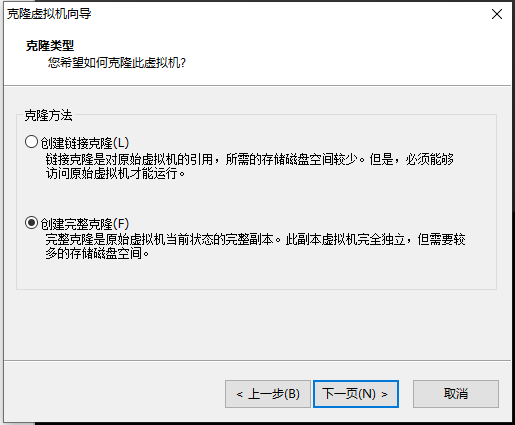 

vm克隆完成后，需要更改ip地址：

```
# vi /etc/sysconfig/network-scripts/ifcfg-ens33
```

修改ip地址

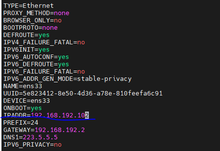 

重启网络：

```
# service network restart
```

再次查看Ip地址可以看到我们的vm就此搭建完成了。

 

### 环境初始化

如果你使用的ssh工具是MobaXterm，当我们需要在三台vm中执行相同命令时，可以点击工具的MultiExec，这样会出现多个小窗，方便同时操作

 

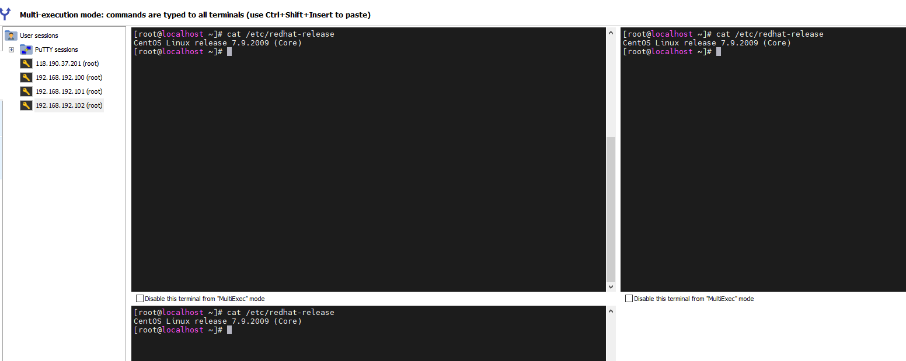  

1. 查看操作系统版本

   ```shell
   [root@localhost ~]# cat /etc/redhat-release
   CentOS Linux release 7.9.2009 (Core)
   ```

2. 主机名解析

   ```
   # vi /etc/hosts
   # 主机名成解析 编辑三台服务器的/etc/hosts文件，添加下面内容
   192.168.109.100  master
   192.168.109.101  node1
   192.168.109.102  node2
   ```

3. 时间同步

   k8s要求集群中的节点时间必须精确一致，这里直接使用chronyd服务从网络同步时间

   在企业中建议使用内部的时间同步服务器

   ```
   # 启动chronyd服务
   [root@master ~]# systemctl start chronyd
   # 设置chronyd服务开机自启
   [root@master ~]# systemctl enable chronyd
   # chronyd服务启动稍等几秒钟，就可以使用date命令验证时间了
   [root@master ~]# date
   ```

4. 禁用iptables和firewalld服务

   kubernetes和docker在运行中会产生大量的iptables规则，为了不让系统规则跟它们混淆，直接关闭系统的规则

   ```
   # 1 关闭firewalld服务
   [root@master ~]# systemctl stop firewalld
   [root@master ~]# systemctl disable firewalld
   # 2 关闭iptables服务
   [root@master ~]# systemctl stop iptables
   [root@master ~]# systemctl disable iptables
   ```

5. 禁用selinux

    selinux是linux系统下的一个安全服务，如果不关闭它，在安装集群中会产生各种各样的奇葩问题

   ```
   # 编辑 /etc/selinux/config 文件，修改SELINUX的值为disabled
   # 注意修改完毕之后需要重启linux服务
   SELINUX=disabled
   ```

6.  禁用swap分区

   swap分区指的是虚拟内存分区，它的作用是在物理内存使用完之后，将磁盘空间虚拟成内存来使用

   启用swap设备会对系统的性能产生非常负面的影响，因此kubernetes要求每个节点都要禁用swap设备

   但是如果因为某些原因确实不能关闭swap分区，就需要在集群安装过程中通过明确的参数进行配置说明

   ```
   # 编辑分区配置文件/etc/fstab，注释掉swap分区一行
   # 注意修改完毕之后需要重启linux服务
    UUID=455cc753-7a60-4c17-a424-7741728c44a1 /boot    xfs     defaults        0 0
    /dev/mapper/centos-home /home                      xfs     defaults        0 0
   # /dev/mapper/centos-swap swap                      swap    defaults        0 0
   ```

7. 修改linux的内核参数

   ```
   # 修改linux的内核参数，添加网桥过滤和地址转发功能
   # 编辑/etc/sysctl.d/kubernetes.conf文件，添加如下配置:
   net.bridge.bridge-nf-call-ip6tables = 1
   net.bridge.bridge-nf-call-iptables = 1
   net.ipv4.ip_forward = 1
   
   # 重新加载配置
   [root@master ~]# sysctl -p
   
   # 加载网桥过滤模块
   [root@master ~]# modprobe br_netfilter
   
   # 查看网桥过滤模块是否加载成功
   [root@master ~]# lsmod | grep br_netfilter
   ```

8. 配置ipvs功能

   在kubernetes中service有两种代理模型，一种是基于iptables的，一种是基于ipvs的

   两者比较的话，ipvs的性能明显要高一些，但是如果要使用它，需要手动载入ipvs模块

   ```
   # 1 安装ipset和ipvsadm
   [root@master ~]# yum install ipset ipvsadmin -y
   
   # 2 添加需要加载的模块写入脚本文件
   [root@master ~]# cat <<EOF >  /etc/sysconfig/modules/ipvs.modules
   #!/bin/bash
   modprobe -- ip_vs
   modprobe -- ip_vs_rr
   modprobe -- ip_vs_wrr
   modprobe -- ip_vs_sh
   modprobe -- nf_conntrack_ipv4
   EOF
   
   # 3 为脚本文件添加执行权限
   [root@master ~]# chmod +x /etc/sysconfig/modules/ipvs.modules
   
   # 4 执行脚本文件
   [root@master ~]# /bin/bash /etc/sysconfig/modules/ipvs.modules
   
   # 5 查看对应的模块是否加载成功
   [root@master ~]# lsmod | grep -e ip_vs -e nf_conntrack_ipv4
   ```

9. 重启服务器

   上面步骤完成之后，需要重新启动linux系统

### 安装docker

```shell
# 1 切换镜像源
[root@master ~]# wget https://mirrors.aliyun.com/docker-ce/linux/centos/docker-ce.repo -O /etc/yum.repos.d/docker-ce.repo

# 2 查看当前镜像源中支持的docker版本
[root@master ~]# yum list docker-ce --showduplicates

# 3 安装特定版本的docker-ce
# 必须指定--setopt=obsoletes=0，否则yum会自动安装更高版本
[root@master ~]# yum install --setopt=obsoletes=0 docker-ce-18.06.3.ce-3.el7 -y

# 4 添加一个配置文件
# Docker在默认情况下使用的Cgroup Driver为cgroupfs，而kubernetes推荐使用systemd来代替cgroupfs
[root@master ~]# mkdir /etc/docker
[root@master ~]# cat <<EOF >  /etc/docker/daemon.json
{
  "exec-opts": ["native.cgroupdriver=systemd"],
  "registry-mirrors": ["https://kn0t2bca.mirror.aliyuncs.com"]
}
EOF

# 5 启动docker
[root@master ~]# systemctl restart docker
[root@master ~]# systemctl enable docker

# 6 检查docker状态和版本
[root@master ~]# docker version
```

### 安装kubernetes组件

```shell
# 由于kubernetes的镜像源在国外，速度比较慢，这里切换成国内的镜像源
# 编辑/etc/yum.repos.d/kubernetes.repo，添加下面的配置 
[kubernetes]
name=Kubernetes
baseurl=http://mirrors.aliyun.com/kubernetes/yum/repos/kubernetes-el7-x86_64
enabled=1
gpgcheck=0
repo_gpgcheck=0
gpgkey=http://mirrors.aliyun.com/kubernetes/yum/doc/yum-key.gpg
       http://mirrors.aliyun.com/kubernetes/yum/doc/rpm-package-key.gpg

# 安装kubeadm、kubelet和kubectl
[root@master ~]# yum install --setopt=obsoletes=0 kubeadm-1.17.4-0 kubelet-1.17.4-0 kubectl-1.17.4-0 -y

# 配置kubelet的cgroup
# 编辑/etc/sysconfig/kubelet，添加下面的配置
KUBELET_CGROUP_ARGS="--cgroup-driver=systemd"
KUBE_PROXY_MODE="ipvs"

# 4 设置kubelet开机自启
[root@master ~]# systemctl enable kubelet
```

### 准备集群镜像

```shell
# 在安装kubernetes集群之前，必须要提前准备好集群需要的镜像，所需镜像可以通过下面命令查看
[root@master ~]# kubeadm config images list

# 下载镜像
# 此镜像在kubernetes的仓库中,由于网络原因,无法连接，下面提供了一种替代方案
images=(
    kube-apiserver:v1.17.4
    kube-controller-manager:v1.17.4
    kube-scheduler:v1.17.4
    kube-proxy:v1.17.4
    pause:3.1
    etcd:3.4.3-0
    coredns:1.6.5
)

for imageName in ${images[@]} ; do
	docker pull registry.cn-hangzhou.aliyuncs.com/google_containers/$imageName
	docker tag registry.cn-hangzhou.aliyuncs.com/google_containers/$imageName 		k8s.gcr.io/$imageName
	docker rmi registry.cn-hangzhou.aliyuncs.com/google_containers/$imageName
done
```

### 集群初始化

下面开始对集群进行初始化，并将node节点加入到集群中

> 下面的操作只需要在`master`节点上执行即可

```shell
# 创建集群
[root@master ~]# kubeadm init \
	--kubernetes-version=v1.17.4 \
    --pod-network-cidr=10.244.0.0/16 \
    --service-cidr=10.96.0.0/12 \
    --apiserver-advertise-address=192.168.109.100

# 创建必要文件
[root@master ~]# mkdir -p $HOME/.kube
[root@master ~]# sudo cp -i /etc/kubernetes/admin.conf $HOME/.kube/config
[root@master ~]# sudo chown $(id -u):$(id -g) $HOME/.kube/config
```

> 下面的操作只需要在`node`节点上执行即可

```

# 将node节点加入集群
# 注意：下面的命令实际是在上一步创建集群时打印出来的，如果未记录下来，可以执行如下命令 kubeadm token create --print-join-command 获取
[root@master ~]# kubeadm join 192.168.109.100:6443 \ 
	--token 8507uc.o0knircuri8etnw2 \
	--discovery-token-ca-cert-hash \
	sha256:6e0934748c82e55c7aa4cb257d59fc90349d6ae7cefc4f579ac50c481400800f
	
# 查看集群状态 此时的集群状态为NotReady，这是因为还没有配置网络插件
[root@master ~]# kubectl get nodes
NAME     STATUS     ROLES    AGE     VERSION
master   NotReady   master   6m43s   v1.17.4
node1    NotReady   <none>   22s     v1.17.4
node2    NotReady   <none>   19s     v1.17.4
```

### 安装网络插件

kubernetes支持多种网络插件，比如flannel、calico、canal等等，任选一种使用即可，本次选择flannel

> 下面操作依旧只在`master`节点执行即可，插件使用的是DaemonSet的控制器，它会在每个节点上都运行

```
# 获取fannel的配置文件
[root@master ~]# wget https://raw.githubusercontent.com/coreos/flannel/master/Documentation/kube-flannel.yml

# 使用配置文件启动fannel
[root@master ~]# kubectl apply -f kube-flannel.yml

# 稍等片刻，再次查看集群节点的状态
[root@master ~]# kubectl get nodes
NAME     STATUS   ROLES    AGE     VERSION
master   Ready    master   15m     v1.17.4
node1    Ready    <none>   8m53s   v1.17.4
node2    Ready    <none>   8m50s   v1.17.4
```

至此，k8s集群环境终于搭建完成了。

## 服务部署

我们在集群中部署一个nginx程序，测试下集群是否在正常工作

```yaml
# 部署nginx
[root@master ~]# kubectl create deployment nginx --image=nginx:1.14-alpine

# 暴露端口
[root@master ~]# kubectl expose deployment nginx --port=80 --type=NodePort

# 查看服务状态
[root@master ~]# kubectl get pods,service
NAME                         READY   STATUS    RESTARTS   AGE
pod/nginx-86c57db685-fdc2k   1/1     Running   0          18m

NAME                 TYPE        CLUSTER-IP      EXTERNAL-IP   PORT(S)        AGE
service/kubernetes   ClusterIP   10.96.0.1       <none>        443/TCP        82m
service/nginx        NodePort    10.104.121.45   <none>        80:32343/TCP   17m

# 4 最后在电脑上访问下部署的nginx服务
```

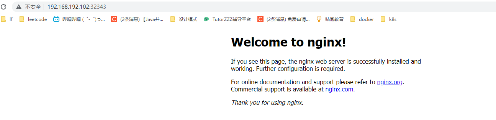 